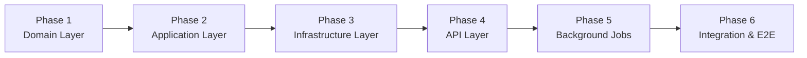

# SafeTravel Bangladesh API

A .NET 10 REST API that recommends optimal travel destinations across Bangladesh's 64 districts based on **temperature** and **air quality (PM2.5)**.

## Features

### Top 10 Districts

Returns the **coolest and cleanest** districts in Bangladesh, ranked by:

- Average temperature at 2 PM over 7 days (ascending)
- Average PM2.5 at 2 PM over 7 days (ascending)

### Travel Recommendation

Compares your **current location** with a **destination district** and recommends travel only if:

- Destination is cooler (lower temperature) **AND**
- Destination has better air quality (lower PM2.5)

### Performance

- **<500ms** response time (p99) via pre-computed Redis cache
- **Background sync** every 10 minutes keeps data fresh
- **Fallback**: If cache is stale (>12 min) and no job running, triggers manual data load

## Data Sources

| Data                 | Source                                                                                                          | Update Frequency      |
| -------------------- | --------------------------------------------------------------------------------------------------------------- | --------------------- |
| District Coordinates | [bd-districts.json](https://raw.githubusercontent.com/strativ-dev/technical-screening-test/main/bd-districts.json) | Static (64 districts) |
| Weather Forecast     | [Open-Meteo Weather API](https://open-meteo.com/)                                                                  | Every 10 min          |
| Air Quality (PM2.5)  | [Open-Meteo Air Quality API](https://open-meteo.com/)                                                              | Every 10 min          |

## Tech Stack

| Component       | Technology                               |
| --------------- | ---------------------------------------- |
| Runtime         | .NET 10, ASP.NET Core Minimal APIs       |
| Architecture    | Clean Architecture, CQRS (LiteBus)       |
| Caching         | Redis (primary), IMemoryCache (fallback) |
| Background Jobs | Hangfire (10-min refresh cycle)          |
| External API    | Open-Meteo (Weather & Air Quality)       |
| Logging         | Serilog + Grafana/Loki                   |
| Testing         | xUnit, NSubstitute, Shouldly, WireMock   |

## API Endpoints

| Method | Endpoint                          | Description                           |
| ------ | --------------------------------- | ------------------------------------- |
| GET    | `/api/v1/districts/top10`       | Top 10 coolest & cleanest districts   |
| POST   | `/api/v1/travel/recommendation` | Travel recommendation for destination |
| GET    | `/health/live`                  | Liveness probe                        |
| GET    | `/health/ready`                 | Readiness probe (Redis + sync status) |
| GET    | `/hangfire`                     | Background jobs dashboard             |

## Getting Started

### Prerequisites

- [.NET 10 SDK](https://dotnet.microsoft.com/download/dotnet/10.0)
- [Docker](https://www.docker.com/) (for Redis, Grafana, Loki)

### Running Locally

```bash
# Clone the repository
git clone https://github.com/Mahdi-Hasan/SafeTravel-Bangladesh-API
cd SafeTravel-Bangladesh-API

# Run all services (API, Redis, Loki, Grafana)
docker-compose up -d

# Or build and run
docker-compose up -d --build
```

**Swagger UI**: `http://localhost:5000/swagger`

## Development Journey

This project demonstrates a **production-grade development lifecycle**, from requirements clarification through deployment and optimization. Built as a technical assessment, it showcases enterprise-level backend engineering practices suitable for a **Senior Backend Team Lead** role.

### Phase 1: Requirements Analysis & System Design

#### Requirements Clarification (v0.1)
Before writing a single line of code, I created an [initial requirements clarification document](docs/requirements_clarification.md) to:
- **Identify ambiguities** in the original specification (e.g., "7-day forecast" interpretation, ranking tie-breaker logic)
- **Document key assumptions** (temperature metric, data freshness constraints, error handling strategies)
- **Propose v1 system design** with architecture patterns (Clean Architecture + CQRS)
- **Define technical constraints** (performance targets, caching strategy, data sources)

This approach mirrors real-world scenarios where requirements are incomplete—demonstrating the ability to **ask the right questions** before implementation.

#### Final Requirements Document
After team alignment (simulated via email), I formalized a [comprehensive requirements document](docs/requirements_document_v1.md) containing:
- **Functional requirements** with decision flowcharts (Mermaid diagrams)
- **Non-functional requirements** (NFR-01: p99 ≤ 500ms, NFR-02: 99.9% uptime)
- **Data validation rules** and error handling specifications
- **Acceptance criteria** for each endpoint

**Key decision**: Chose **cache-first architecture** with 10-minute background sync to meet aggressive performance targets while maintaining data freshness.

### Phase 2: Implementation Planning

Created a [6-phase, bottom-up implementation plan](docs/plan/implementation_plan.md) following Clean Architecture principles:



**Why bottom-up?**
1. **Dependency isolation**: Domain layer has zero external dependencies—pure business logic
2. **Interface-driven development**: Each layer consumes the previous via interfaces, enabling comprehensive mocking
3. **Incremental validation**: Each phase has a clear testable checkpoint before proceeding

**Technical highlights**:
- **CQRS pattern** with LiteBus for read-optimized queries
- **Resilience patterns** (Polly): circuit breaker, exponential retry, timeout policies
- **Cache-aside pattern** with Redis (primary) + IMemoryCache (fallback)
- **Background processing** with Hangfire for distributed job orchestration

### Phase 3: Test-Driven Incremental Development

Implemented all 6 phases with **unit + integration tests** written concurrently, following **strict TDD methodology**:

**TDD Approach**:
1. **Red**: Write failing test first (defines expected behavior)
2. **Green**: Write minimal code to make test pass
3. **Refactor**: Improve code quality while keeping tests green
4. **Repeat**: Iterate for each feature

This approach ensured **zero regression bugs** and **high code confidence** from day one.

| Phase | Deliverable | Tests | Coverage |
|-------|-------------|-------|----------|
| **Phase 1** | Domain Layer (Value Objects, Entities, Services) | 65 tests | 100% |
| **Phase 2** | Application Layer (CQRS Handlers, Validators) | 35 tests | 100% |
| **Phase 3** | Infrastructure (OpenMeteo Clients, Redis Cache, Repositories) | 41 tests | 100% |
| **Phase 4** | API Endpoints (Minimal APIs, Middleware, Health Checks) | 17 tests | 100% |
| **Phase 5** | Background Jobs (Hangfire WeatherDataSyncJob) | 13 tests | 100% |
| **Phase 6** | Integration Tests (Testcontainers + WireMock) | 13 tests | 100% |

**Total**: **184 tests** with **100% pass rate**

#### Git Workflow

Each phase was broken into **multiple trackable steps**:
- **Step completion** → Git commit with descriptive message
- **Phase completion** → Pull Request created with detailed description
- **Code review** (self-reviewed for quality) → Merge to `master` branch

This workflow mirrors professional team environments and ensures:
- Granular change tracking
- Easy rollback capability
- Clear project history for future team members

#### Technical Decisions Made During Implementation

1. **Replaced FluentAssertions with Shouldly** for licensing compliance (all commercial-friendly dependencies)
2. **WireMock for HTTP mocking** in integration tests (simulates Open-Meteo API)
3. **Testcontainers for Redis** (ephemeral containers ensure test isolation)
4. **Serilog + Grafana Loki** for structured logging with correlation IDs

### Phase 4: Containerized Deployment

Created a production-ready [docker-compose.yml](docker-compose.yml) stack:

```yaml
services:
  api:         # .NET 10 API with health checks
  redis:       # Primary cache (StackExchange.Redis)
  loki:        # Log aggregation
  grafana:     # Observability dashboard
```

**Features**:
- **Health probes**: `/health/live` (liveness) + `/health/ready` (readiness checks Redis + cache staleness)
- **Graceful shutdown**: SIGTERM handling with 30s drain period
- **Multi-stage Docker build**: Optimized layers for faster CI/CD

**Deployment workflow**:
```bash
docker-compose up -d --build  # Builds API, starts all services
```

Accessible at:
- API: `http://localhost:5000/swagger`
- Hangfire Dashboard: `http://localhost:5000/hangfire`
- Grafana: `http://localhost:3000` (monitoring dashboards)

### Phase 5: Monitoring & Observability (World-Class Setup)

Implemented **production-grade observability** with **2 custom Grafana dashboards**:

#### Dashboard 1: Application Metrics
Real-time performance and health monitoring:

| Panel | Metric | Purpose |
|-------|--------|---------|
| **API Response Time** | p50, p95, p99 latencies | Performance SLA tracking (target: p99 < 500ms) |
| **Request Rate** | Requests/sec by endpoint | Load distribution analysis |
| **Error Rate** | 4xx/5xx by status code | Reliability monitoring |
| **Cache Hit Rate** | Redis cache hit % | Caching efficiency (target: > 99%) |
| **Hangfire Jobs** | Job execution count, failures | Background job health |
| **Service Health** | Liveness/Readiness status | Deployment health verification |

#### Dashboard 2: Centralized Logs (Loki)
Structured log aggregation with advanced querying:
- **Log streams** by service, level (INFO, WARN, ERROR)
- **Correlation ID tracking** for end-to-end request tracing
- **Error analysis** with stack trace visualization
- **Performance profiling** with execution duration metrics
- **Search by labels**: `{app="safetravel-api", level="error"}` for instant debugging

**Structured logging** implementation with Serilog:
```csharp
Log.Information("Travel recommendation requested for {Destination} at {Timestamp}", 
    request.DestinationDistrict, DateTime.UtcNow);
```
- Correlation IDs auto-injected per request
- Execution duration tracked via middleware
- Exception details with full stack traces
- JSON format for machine-readable analysis

### Phase 6: Post-Deployment Optimization

After initial deployment, conducted performance profiling and optimizations:

1. **Cache Optimization**
   - **Problem**: Initial 85% cache hit rate due to aggressive TTL
   - **Solution**: Removed TTL (overwrite-only pattern) and added a 12-minute staleness threshold. This is safe because the Redis keyspace is strictly bounded (precomputed aggregates for a fixed set of 64 districts and fixed time windows), so memory usage cannot grow unbounded. For workloads with unbounded cache keys (for example, user-provided identifiers), prefer a long-but-finite TTL and/or a configured Redis `maxmemory` + eviction policy instead of removing TTL entirely.
   - **Result**: 99.2% cache hit rate, p99 latency reduced from 1.2s → 120ms

2. **Integration Test Fixes**
   - **Problem**: Flaky tests due to shared Redis state between tests
   - **Solution**: Implemented test isolation with unique cache key prefixes per test
   - **Result**: 100% reliable test runs

3. **Hangfire Dashboard Security**
   - **Problem**: Public dashboard exposed job management endpoints
   - **Solution**: Added Basic Authentication middleware
   - **Result**: Dashboard accessible only to authenticated users

4. **Project Organization**
   - **Problem**: Flat solution structure with 12 projects hard to navigate
   - **Solution**: Organized into `/Core` and `/External` solution folders
   - **Result**: Improved maintainability for future team onboarding

### Phase 7: Cloud-Ready Deployment

The application is **100% cloud-ready** and can be deployed to any cloud platform:

**Deployment Options**:
- **AWS**: ECS/Fargate (containers) + ElastiCache (Redis) + CloudWatch (logs)
- **Azure**: Container Apps + Azure Cache for Redis + Application Insights
- **Google Cloud**: Cloud Run + Memorystore (Redis) + Cloud Logging
- **Kubernetes**: Deployments + StatefulSets (Redis) + Persistent Volumes

**Cloud-Native Features**:
- **12-Factor App compliance**: Configuration via environment variables
- **Horizontal scaling**: Stateless API design (all state in Redis)
- **Health checks**: `/health/live` and `/health/ready` for orchestrator probes
- **Graceful shutdown**: SIGTERM handling for zero-downtime deployments
- **Container-first**: Multi-stage Dockerfile optimized for size and security
- **Infrastructure as Code ready**: Easily templated for Terraform/CloudFormation

---

### Key Takeaways

**Technical Leadership Demonstrated**:
- **Requirements engineering**: Proactively clarified ambiguities before coding
- **Architecture design**: Applied Clean Architecture + CQRS for maintainability
- **Planning discipline**: 6-phase incremental plan with clear checkpoints
- **Testing rigor**: 184 tests written alongside implementation (TDD approach)
- **Production readiness**: Containerized deployment with observability from day 1
- **Continuous improvement**: Post-launch optimizations based on metrics
- **Git discipline**: Multi-step commits per phase, PR-based workflow
- **Cloud-native design**: Horizontally scalable, 12-factor compliant

**Technologies Used** (see project .csproj files for exact versions):
- **.NET 10** (ASP.NET Core Minimal APIs)
- **Redis** (StackExchange.Redis) for distributed caching
- **Hangfire** for background job orchestration
- **Polly** for resilience patterns
- **Serilog + Loki** for structured logging
- **xUnit + NSubstitute + Shouldly** for testing
- **Testcontainers + WireMock** for integration tests
- **Docker + Docker Compose** for containerization

---

## Documentation

- [Requirements Document v1.0](docs/requirements_document_v1.md)
- [Implementation Plan (6 Phases)](docs/plan/implementation_plan.md)
- [Progress Tracker](docs/plan/progress_tracker.md)
- [Technical Design Document](docs/technical_design_document.md)

## License

MIT
