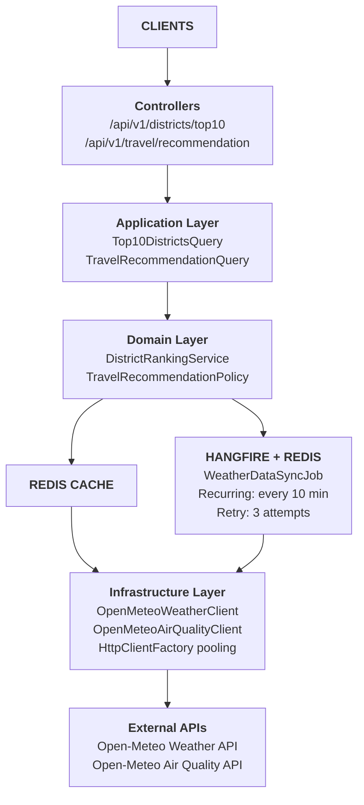

# Architecture & System Overview

**Part of:** [SafeTravel Bangladesh API Technical Design](../technical_design_document.md)

**Version:** 1.0
**Date:** February 4, 2026

---

## Table of Contents

1. [System Overview](#1-system-overview)
2. [Non-Functional Requirements](#2-non-functional-requirements)
3. [High-Level Architecture](#3-high-level-architecture)
4. [Technology Stack](#4-technology-stack)
5. [Clean Architecture Layer Responsibilities](#5-clean-architecture-layer-responsibilities)

---

## 1. System Overview

### 1.1 Purpose

SafeTravel Bangladesh API is a production-grade .NET 10 REST API that recommends optimal travel destinations across Bangladesh's 64 districts based on **temperature** and **air quality (PM2.5)** metrics.

### 1.2 Core Capabilities

| Feature                         | Description                                                                                                                 |
| ------------------------------- | --------------------------------------------------------------------------------------------------------------------------- |
| **Top 10 Districts**      | Returns the 10 coolest and cleanest districts ranked by 7-day average temperature at 2 PM, with PM2.5 as tie-breaker        |
| **Travel Recommendation** | Compares user's current location with destination district on a specific date, returning "Recommended" or "Not Recommended" |

### 1.3 Key Design Principles

- **Cache-first with fallback** — API reads from Redis first; if unavailable/empty, falls back to Open-Meteo directly
- **Background-first data fetching** — Scheduled jobs pre-fetch and cache data for optimal performance
- **Graceful degradation** — Serves cached data when available, fresh data when cache misses
- **Crash resilience** — Jobs survive restarts and deployments
- **Startup district dictionary** — All 64 district coordinates loaded into in-memory dictionary at startup for O(1) lookup

---

## 2. Non-Functional Requirements

### 2.1 Performance

| Metric            | Target         | Strategy                                 |
| ----------------- | -------------- | ---------------------------------------- |
| API Response Time | ≤ 500ms (p99) | Pre-computed cache, no runtime API calls |
| Cache Hit Rate    | > 99%          | Background refresh every 10 minutes      |
| Throughput        | 1000 RPS       | Stateless API, Redis-backed cache        |

### 2.2 Reliability

| Metric           | Target        | Strategy                                             |
| ---------------- | ------------- | ---------------------------------------------------- |
| API Availability | 99.9%         | Cache-first with stale fallback                      |
| Data Freshness   | ≤ 12 minutes | 10-minute refresh cycle + 2 min buffer for job delay |
| Job Success Rate | > 99.5%       | Retry policies, partial failure handling             |

### 2.3 Scalability

- **Horizontal scaling**: Stateless API instances behind load balancer
- **Shared state**: Redis as single source of truth for cache and job coordination
- **Background jobs**: Single Hangfire server with distributed lock prevents duplicates

### 2.4 Data Correctness

- Atomic cache updates prevent partial reads
- Version-stamped cache entries for consistency
- Validation on all external API responses

---

## 3. High-Level Architecture



### Data Flow

1. **Background Job (every 10 minutes)**:

   - Hangfire triggers `WeatherDataSyncJob`
   - Job fetches weather + air quality for all 64 districts via bulk requests
   - Computes averages, rankings, and per-day forecasts
   - Atomically updates Redis cache
2. **API Request Flow**:

   - Controller receives request → dispatches Litebus query
   - Query handler attempts Redis cache first
   - **If cache hit**: Returns pre-computed response (fast path, <50ms)
   - **If cache miss/Redis down**: Falls back to Open-Meteo API directly (slow path, ~2-3s)

---

## 4. Technology Stack

| Component                   | Technology                 | Justification                                              |
| --------------------------- | -------------------------- | ---------------------------------------------------------- |
| **Runtime**           | .NET 10                    | Latest version, performance improvements, native AOT ready |
| **Framework**         | ASP.NET Core Minimal APIs  | Low overhead, high performance                             |
| **Architecture**      | Clean Architecture         | Separation of concerns, testability                        |
| **CQRS**              | LiteBus                    | Lightweight, decouples handlers, minimal overhead          |
| **Background Jobs**   | Hangfire + Redis           | Persistent, survives restarts, built-in retry              |
| **Cache**             | Redis                      | Distributed, atomic operations, high throughput            |
| **HTTP Client**       | IHttpClientFactory + Polly | Connection pooling, resilience policies                    |
| **Serialization**     | System.Text.Json           | Native, high performance                                   |
| **Validation**        | FluentValidation           | Declarative, testable                                      |
| **Logging**           | Serilog + Grafana/Loki     | Structured logging, centralized log aggregation            |
| **API Documentation** | Swagger/OpenAPI            | Interactive docs, client SDK generation                    |
| **Containerization**  | Docker + docker-compose    | Local Redis, consistent environments                       |

### 4.1 Environment Variables

| Variable                       | Description                                             | Default Value                                                                                     |
| ------------------------------ | ------------------------------------------------------- | ------------------------------------------------------------------------------------------------- |
| `CACHE_STALENESS_MINUTES`    | Cache freshness threshold in minutes (integer; 1–1440) | 12                                                                                                |
| `DISTRICT_DATA_URL`          | URL to district coordinates JSON                        | `https://raw.githubusercontent.com/strativ-dev/technical-screening-test/main/bd-districts.json` |
| `OPENMETEO_WEATHER_BASE_URL` | Open-Meteo Weather API base URL                         | `https://api.open-meteo.com/v1/`                                                                |
| `OPENMETEO_AIR_QUALITY_URL`  | Open-Meteo Air Quality API base URL                     | `https://air-quality-api.open-meteo.com/v1/`                                                    |
| `REDIS_CONNECTION_STRING`    | Redis connection string                                 | `localhost:6379`                                                                                |
| `HANGFIRE_REDIS_PREFIX`      | Hangfire Redis key prefix                               | `safetravel:hangfire`                                                                           |
| `WEATHER_SYNC_CRON`          | Hangfire sync job cron expression                       | `*/10 * * * *` (every 10 minutes)                                                               |

---

## 5. Clean Architecture Layer Responsibilities

```
SafeTravel.Bangladesh/
├── src/
│   ├── SafeTravel.Domain/              # Layer 1: Enterprise Business Rules
│   ├── SafeTravel.Application/         # Layer 2: Application Business Rules  
│   ├── SafeTravel.Infrastructure/      # Layer 3: Interface Adapters
│   └── SafeTravel.Api/                 # Layer 4: Frameworks & Drivers
└── tests/
    ├── SafeTravel.Domain.Tests/
    ├── SafeTravel.Application.Tests/
    └── SafeTravel.Integration.Tests/
```

### 5.1 Domain Layer (`SafeTravel.Domain`)

**Zero external dependencies.** Contains:

- **Entities**: `District`, `WeatherForecast`, `AirQualityReading`
- **Value Objects**: `Coordinates`, `Temperature`, `PM25Level`, `DateRange`
- **Domain Services**: `DistrictRankingService`, `TravelRecommendationPolicy`
- **Interfaces**: `IDistrictRepository`, `IWeatherDataCache`
- **Exceptions**: `ForecastUnavailableException`, `InvalidDateRangeException`

**Key Domain Models (Pseudo):**

```
District { Id, Name, Location(Lat, Long) }
WeatherSnapshot { Temperature, PM25, Date }
RankedDistrict { Rank, DistrictId, DistrictName, AvgTemp, AvgPM25 }
RecommendationResult { IsRecommended, Reason }
```

### 5.2 Application Layer (`SafeTravel.Application`)

Contains **use cases** implemented as Litebus queries.

- **Queries**: `GetTop10DistrictsQuery`, `GetTravelRecommendationQuery`
- **Query Handlers**: Business orchestration, cache access with API fallback
- **DTOs**: Response models, request validation
- **Interfaces**: `IWeatherDataCache`, `IOpenMeteoClient`

**Query Handler Logic (Pseudo):**

```
GetTop10DistrictsHandler:
    rankings = TryGetFromRedisCache()
  
    IF rankings IS NULL OR Redis unavailable THEN
        weatherData = FetchFromOpenMeteoAPI(all 64 districts)
        rankings = ComputeRankings(weatherData)
        TrySaveToCache(rankings)  // Best effort
    END IF
  
    RETURN Top10(rankings)
```

### 5.3 Infrastructure Layer (`SafeTravel.Infrastructure`)

Implements all external dependencies:

- **External API Clients**: `OpenMeteoWeatherClient`, `OpenMeteoAirQualityClient`
- **Cache Implementation**: `RedisWeatherDataCache`
- **Background Jobs**: `WeatherDataSyncJob`
- **Data Providers**: `DistrictDataProvider` (loads JSON into dictionary at startup)

### 5.4 API Layer (`SafeTravel.Api`)

Thin layer with:

- **Minimal API Endpoints**: Route definitions only
- **Middleware**: Exception handling, request logging
- **Configuration**: DI registration, Hangfire dashboard

### 5.5 Startup District Dictionary

At application startup, load all 64 districts into an in-memory dictionary for O(1) coordinate lookup:

**Startup Logic (Pseudo):**

```
ON Application Start:
    jsonContent = ReadFile("bd-districts.json")
    districts = Deserialize<List<District>>(jsonContent)
  
    // Create dictionary keyed by district name (case-insensitive)
    DistrictDictionary = districts.ToDictionary(
        key: d => d.Name.ToLowerInvariant(),
        value: d => d
    )
  
    // Register as Singleton in DI container
    services.AddSingleton(DistrictDictionary)
```

**Usage:**

```
GetDistrictByName(name):
    RETURN DistrictDictionary[name.ToLowerInvariant()] OR throw NotFoundException
```

---

**Next:** [Data &amp; Caching](./02_data_and_caching.md)
