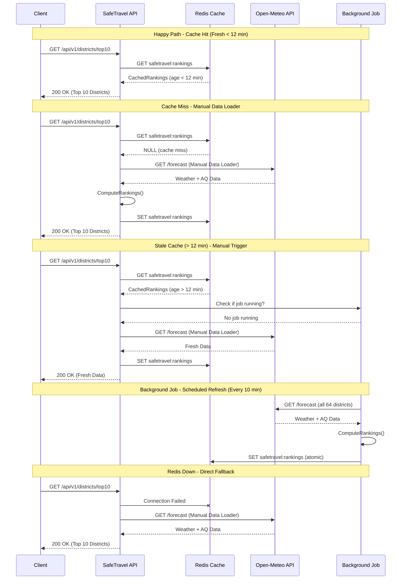

# Data & Caching Strategy

**Part of:** [SafeTravel Bangladesh API Technical Design](../technical_design_document.md)

**Version:** 1.0
**Date:** February 4, 2026

---

## Table of Contents

1. [Background Job Design (Hangfire)](#1-background-job-design-hangfire)
2. [Caching Strategy](#2-caching-strategy)
3. [Domain Logic](#3-domain-logic)
4. [HTTP & External API Best Practices](#4-http--external-api-best-practices)

---

## 1. Background Job Design (Hangfire)

### 1.1 Why Hangfire Over IHostedService

| Aspect                         | IHostedService             | Hangfire                                      |
| ------------------------------ | -------------------------- | --------------------------------------------- |
| **Crash Recovery**       | Job state lost on restart  | Jobs persisted in Redis, resume after restart |
| **Deployment Safety**    | Running jobs terminated    | Jobs continue on other instances or retry     |
| **Retry Logic**          | Manual implementation      | Built-in exponential backoff                  |
| **Monitoring**           | Custom dashboards needed   | Built-in web dashboard                        |
| **Duplicate Prevention** | Manual distributed locking | `DisableConcurrentExecution` attribute      |
| **Job History**          | Not available              | Full execution history with errors            |

> [!IMPORTANT]
> **IHostedService** is unsuitable for production because a deployment or pod restart will terminate in-flight jobs without recovery. Hangfire persists job state to Redis, enabling automatic resume.

### 1.2 Job Scheduling

**Job Design (Pseudo):**

```
WeatherDataSyncJob:
    [DisableConcurrentExecution: 300s timeout]
    [AutomaticRetry: 3 attempts with delays 30s, 60s, 120s]
  
    ExecuteAsync():
        districts = GetAllDistrictsFromDictionary()
  
        // Bulk fetch for all 64 districts (single API call each)
        weatherData = OpenMeteoClient.GetBulkForecast(districts, 7 days)
        airQualityData = OpenMeteoClient.GetBulkAirQuality(districts, 7 days)
  
        // Process and compute rankings
        processedData = ProcessWeatherData(districts, weatherData, airQualityData)
  
        // Atomic cache update
        RedisCache.SetAllDistrictData(processedData)
        RedisCache.SetRankings(ComputeRankings(processedData))
  
        Log("Weather sync completed for {districts.Count} districts")
```

**Job Registration (Pseudo):**

```
ON Application Start:
    Hangfire.UseRedisStorage(connectionString, prefix: "safetravel:hangfire")
    Hangfire.AddServer(workerCount: 2, queues: ["weather-sync", "default"])
  
    RecurringJob.AddOrUpdate(
        jobId: "weather-data-sync",
        job: WeatherDataSyncJob.ExecuteAsync,
        cron: "*/10 * * * *",  // Every 10 minutes
        timezone: "Asia/Dhaka"
    )
```

### 1.3 Idempotency

Jobs are **idempotent by design**:

- Each execution completely replaces cached data
- No incremental updates that could cause inconsistency
- Cache keys are fixed, not time-based
- `DisableConcurrentExecution` prevents parallel execution

### 1.4 Retry Strategy

| Attempt | Delay | Cumulative Time                    |
| ------- | ----- | ---------------------------------- |
| 1       | 30s   | 30s                                |
| 2       | 60s   | 1m 30s                             |
| 3       | 120s  | 3m 30s                             |
| Failed  | -     | Job marked failed, alert triggered |

### 1.5 Failure Handling

**Error Handling Strategy (Pseudo):**

```
TRY:
    SyncWeatherData()
CATCH HttpRequestException (429 TooManyRequests):
    Log.Warning("Rate limited, will retry")
    THROW  // Let Hangfire retry with backoff
CATCH HttpRequestException (Network failure):
    Log.Warning("API unreachable, will retry")
    THROW  // Let Hangfire retry
CATCH JsonException:
    Log.Error("Invalid API response - fail immediately")
    THROW BackgroundJobFailedException  // Don't retry corrupt data
```

---

## 2. Caching Strategy

### 2.1 Cache Architecture

```
Redis Instance
├── safetravel:rankings                    # Pre-computed top 64 rankings
├── safetravel:districts:{districtId}      # Per-district 7-day forecast
├── safetravel:metadata                    # Last sync timestamp, version
└── safetravel:hangfire:*                  # Hangfire job storage
```

### 2.2 Cache Keys & TTL

| Key Pattern                   | Content                              | TTL       | Rationale                                              |
| ----------------------------- | ------------------------------------ | --------- | ------------------------------------------------------ |
| `safetravel:rankings`       | Sorted list of all 64 districts      | 20 min    | ~1.7x staleness threshold (12 min) for fallback buffer |
| `safetravel:districts:{id}` | 7-day forecast for single district   | 20 min    | Matches rankings TTL                                   |
| `safetravel:metadata`       | `{ lastSync, version, isHealthy }` | No expiry | Always available for health checks                     |

### 2.3 Cache Data Structures (Pseudo)

```
CachedRankings {
    Districts: List<RankedDistrict>
    GeneratedAt: DateTime
    Version: int
    IsStale: bool  // True if (Now - GeneratedAt) > 12 minutes
}

RankedDistrict {
    Rank, DistrictId, DistrictName, AvgTemp, AvgPM25
}

CachedDistrictForecast {
    DistrictId: string
    Forecasts: List<DailyForecast>  // 7 days
    GeneratedAt: DateTime
}

DailyForecast { Date, TempAt2PM, PM25At2PM }
```

### 2.4 Cache-Aside with Manual Data Loader (Pseudo)

The staleness threshold is **12 minutes** (10 min job interval + 2 min buffer). If cache data is older than 12 minutes AND no background job is currently running, the API will **manually trigger the data loader** synchronously.

```
GetRankingsAsync():
    stalenessThreshold = 12 minutes  // 10 min job + 2 min buffer
  
    // Step 1: Try Redis cache with freshness check
    TRY:
        cacheEntry = Redis.Get("safetravel:rankings")
  
        IF cacheEntry IS NOT NULL THEN
            dataAge = Now - cacheEntry.GeneratedAt
  
            IF dataAge <= stalenessThreshold THEN
                // Data is fresh - return immediately
                RETURN cacheEntry
            ELSE
                // Data is stale - check if background job is running
                IF Hangfire.IsJobRunning("weather-data-sync") THEN
                    // Job is running, return stale data (will be fresh soon)
                    Log.Info("Cache stale but job running, returning stale data")
                    RETURN cacheEntry
                ELSE
                    // No job running - manually trigger data loader
                    Log.Info("Cache stale ({dataAge} min), manually loading fresh data")
                    GOTO ManualDataLoad
                END IF
            END IF
    CATCH RedisConnectionException:
        Log.Warning("Redis unavailable")

    ManualDataLoad:
    // Step 2: Manual Data Loader (synchronous fetch)
    Log.Info("Manually fetching fresh data from Open-Meteo")
    districts = GetAllDistrictsFromDictionary()
    weatherData = OpenMeteoClient.GetBulkForecast(districts)
    airQualityData = OpenMeteoClient.GetBulkAirQuality(districts)

    rankings = ComputeRankings(weatherData, airQualityData)

    // Update cache synchronously
    TRY:
        Redis.Set("safetravel:rankings", rankings, TTL: 20 min)
    CATCH:
        Log.Warning("Failed to update cache")

    RETURN rankings
```

### 2.5 Cache Behavior Summary

| Scenario                                      | Behavior                                                          |
| --------------------------------------------- | ----------------------------------------------------------------- |
| Redis available + data < 12 min               | Return from Redis (fast path ~50ms)                               |
| Redis available + data > 12 min + job running | Return stale data (job will refresh soon)                         |
| Redis available + data > 12 min + no job      | **Manual data loader** → fetch fresh, update cache, return |
| Redis unavailable                             | **Manual data loader** → fetch from Open-Meteo (~2-3s)     |
| Cache empty on startup                        | **Manual data loader** → fetch from Open-Meteo             |

### 2.6 Cache-Aside Pattern Sequence Diagram



---

## 3. Domain Logic

### 3.1 Ranking Logic (Pseudo)

```
ComputeRankings(districtData):
    // Sort by coolest first, then cleanest air as tie-breaker
    sorted = districtData
        .OrderBy(AvgTempAt2PM)      // Primary: Lowest temp
        .ThenBy(AvgPM25At2PM)       // Secondary: Lowest PM2.5
  
    FOR EACH district IN sorted WITH index:
        YIELD RankedDistrict {
            Rank: index + 1,
            DistrictId, DistrictName,
            AvgTemp: Round(temp, 1),
            AvgPM25: Round(pm25, 1)
        }
```

### 3.2 Temperature & PM2.5 Averaging (Pseudo)

```
AggregateWeatherData(district, weatherData, airQualityData, startDate, days=7):
    targetDates = [startDate, startDate+1, ..., startDate+6]  // 7 days
  
    temperatures = []
    pm25Values = []
  
    FOR EACH date IN targetDates:
        temp = GetValueAt2PM(weatherData, date)    // 14:00 local time
        pm25 = GetValueAt2PM(airQualityData, date)
  
        IF temp IS NOT NULL THEN temperatures.Add(temp)
        IF pm25 IS NOT NULL THEN pm25Values.Add(pm25)
  
    // Require at least 70% data coverage
    IF temperatures.Count < days * 0.7 THEN
        THROW InsufficientDataException
  
    RETURN {
        District: district,
        AvgTempAt2PM: Average(temperatures),
        AvgPM25At2PM: Average(pm25Values) OR 0 if empty,
        DataPoints: temperatures.Count
    }
```

### 3.3 Recommendation Policy (Pseudo)

```
EvaluateRecommendation(origin, destination):
    isCooler = destination.Temp < origin.Temp
    isCleaner = destination.PM25 < origin.PM25
  
    isRecommended = isCooler AND isCleaner  // BOTH must be true
  
    IF isRecommended THEN
        tempDiff = origin.Temp - destination.Temp
        pm25Improvement = (1 - destination.PM25 / origin.PM25) * 100
        reason = "{destination} is {tempDiff}°C cooler and has {pm25Improvement}% better air quality"
    ELSE IF NOT isCooler AND NOT isCleaner THEN
        reason = "{destination} is both warmer and has worse air quality"
    ELSE IF NOT isCooler THEN
        reason = "Better air quality but warmer - both conditions must be better"
    ELSE
        reason = "Cooler but worse air quality - both conditions must be better"
  
    RETURN { IsRecommended: isRecommended, Reason: reason }
```

---

## 4. HTTP & External API Best Practices

### 4.1 HttpClient Configuration

Use `IHttpClientFactory` with Polly resilience policies:

**Configuration (Pseudo):**

```
HttpClient for OpenMeteo:
    BaseAddress: "https://api.open-meteo.com/v1/"
    Timeout: 30 seconds
  
    Policies:
        - Retry: 3 attempts with exponential backoff (2^attempt seconds + jitter)
        - CircuitBreaker: Opens after 5 failures, stays open for 30s
        - Timeout: 10s per attempt
```

### 4.2 Bulk API Requests

Open-Meteo supports fetching multiple locations in a single request using comma-separated coordinates:

**Bulk Request (Pseudo):**

```
GetBulkForecast(districts, forecastDays):
    latitudes = Join(districts.Select(d => d.Lat), ",")
    longitudes = Join(districts.Select(d => d.Long), ",")
  
    url = "forecast?latitude={latitudes}&longitude={longitudes}
           &hourly=temperature_2m&forecast_days={forecastDays}&timezone=Asia/Dhaka"
  
    response = HttpClient.GetAsync(url)
    RETURN Deserialize<BulkWeatherResponse>(response)
```

### 4.3 Timeout Configuration

| Layer              | Timeout | Purpose                 |
| ------------------ | ------- | ----------------------- |
| HttpClient.Timeout | 30s     | Overall request timeout |
| Polly Timeout      | 10s     | Per-attempt timeout     |
| Hangfire Job       | 300s    | Total job execution     |
| Redis Operations   | 5s      | Cache read/write        |

---

**Previous:** [Architecture & Overview](./01_architecture_overview.md) | **Next:** [API & Operations](./03_api_and_operations.md)
