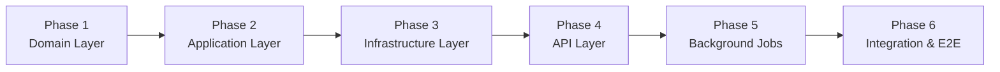

# SafeTravel Bangladesh API — Implementation Plan

**Approach:** Bottom-up, Interface-driven, Incremental Testable Steps  
**Date:** February 5, 2026

---

## Overview

This plan implements the SafeTravel Bangladesh API following Clean Architecture with a **bottom-up** approach. We start from the Domain layer (no dependencies) and work upward. All services are consumed through interfaces, enabling thorough testing at each phase.

### High-Level Phases



---

## Phase 1: Domain Layer (Foundation)

**Goal:** Create the core business logic with zero external dependencies.

### [NEW] Project: `SafeTravel.Domain`

Pure C# library with entities, value objects, domain services, and interfaces.

---

#### [NEW] `Entities/District.cs`
- Properties: `Id`, `Name`, `Coordinates`
- Immutable entity representing a Bangladesh district

#### [NEW] `ValueObjects/Coordinates.cs`
- Properties: `Latitude`, `Longitude`
- Validation: Lat ∈ [-90, 90], Long ∈ [-180, 180]
- Immutable with equality by value

#### [NEW] `ValueObjects/Temperature.cs`
- Property: `Celsius`
- Factory method for validation

#### [NEW] `ValueObjects/PM25Level.cs`
- Property: `Value` (μg/m³)
- Method: `GetAirQualityCategory()` → Good/Moderate/Unhealthy

#### [NEW] `ValueObjects/DateRange.cs`
- Properties: `Start`, `End`
- Validation: End ≥ Start, within 7 days

---

#### [NEW] `Models/WeatherSnapshot.cs`
- Properties: `Date`, `Temperature`, `PM25Level`, `RecordedAt`
- Represents weather data at a specific time (14:00)

#### [NEW] `Models/RankedDistrict.cs`
- Properties: `Rank`, `District`, `AvgTemperature`, `AvgPM25`, `GeneratedAt`

#### [NEW] `Models/RecommendationResult.cs`
- Properties: `IsRecommended`, `Reason`
- Static factory: `Recommended(reason)`, `NotRecommended(reason)`

---

#### [NEW] `Services/DistrictRankingService.cs`
Core ranking algorithm:
```
ComputeRankings(districtsWithWeather):
    RETURN districts
        .OrderBy(AvgTemp)
        .ThenBy(AvgPM25)
        .Select((d, i) => RankedDistrict(rank: i+1, ...))
```

#### [NEW] `Services/TravelRecommendationPolicy.cs`
Decision engine:
```
Evaluate(origin, destination):
    isCooler = destination.Temp < origin.Temp
    isCleaner = destination.PM25 < origin.PM25
    isRecommended = isCooler AND isCleaner
    RETURN RecommendationResult(isRecommended, BuildReason(...))
```

#### [NEW] `Services/WeatherAggregator.cs`
Computes 7-day averages at 14:00:
```
Aggregate(hourlyData, days=7):
    values2PM = ExtractValuesAt2PM(hourlyData)
    RETURN Average(values2PM)
```

---

#### [NEW] `Interfaces/IDistrictRepository.cs`
```csharp
District? GetByName(string name);
IReadOnlyList<District> GetAll();
```

#### [NEW] `Interfaces/IWeatherDataCache.cs`
```csharp
CachedRankings? GetRankings();
void SetRankings(CachedRankings rankings);
CachedDistrictForecast? GetDistrictForecast(string districtId);
void SetDistrictForecast(string districtId, CachedDistrictForecast forecast);
CacheMetadata? GetMetadata();
```

#### [NEW] `Interfaces/IOpenMeteoClient.cs`
```csharp
Task<BulkWeatherResponse> GetBulkForecastAsync(IEnumerable<Coordinates> locations, int days);
Task<BulkAirQualityResponse> GetBulkAirQualityAsync(IEnumerable<Coordinates> locations, int days);
```

---

#### [NEW] `Exceptions/DistrictNotFoundException.cs`
#### [NEW] `Exceptions/InvalidDateRangeException.cs`
#### [NEW] `Exceptions/InsufficientDataException.cs`
#### [NEW] `Exceptions/WeatherDataUnavailableException.cs`

---

### Phase 1 Tests

#### [NEW] Project: `SafeTravel.Domain.Tests`

| Test Class | Coverage |
|------------|----------|
| `CoordinatesTests` | Validation, equality, edge cases (Bangladesh bounds) |
| `TemperatureTests` | Value creation, formatting |
| `PM25LevelTests` | Category classification (Good/Moderate/Unhealthy) |
| `DateRangeTests` | Valid ranges, 7-day constraint, past date rejection |
| `DistrictRankingServiceTests` | Sorting correctness, tie-breaker by PM2.5, edge cases |
| `TravelRecommendationPolicyTests` | All 4 combinations (cooler+cleaner, cooler+dirtier, warmer+cleaner, warmer+dirtier) |
| `WeatherAggregatorTests` | 7-day averaging, 14:00 extraction, insufficient data handling |

---

## Phase 2: Application Layer (Use Cases)

**Goal:** Implement query handlers with LiteBus CQRS.

### [NEW] Project: `SafeTravel.Application`

Dependencies: `SafeTravel.Domain`, `LiteBus`

---

#### [NEW] `DTOs/RankedDistrictDto.cs`
API response model with rank, name, avgTemp, avgPM25, airQualityCategory

#### [NEW] `DTOs/TravelRecommendationDto.cs`
Response with recommendation, reason, comparison data, travelDate

#### [NEW] `DTOs/Top10DistrictsResponse.cs`
```csharp
List<RankedDistrictDto> Data
ResponseMetadata Metadata  // GeneratedAt, ForecastPeriod, IsStale
```

#### [NEW] `DTOs/TravelRecommendationRequest.cs`
```csharp
CurrentLocation { Latitude, Longitude }
DestinationDistrict
TravelDate
```

---

#### [NEW] `Queries/GetTop10DistrictsQuery.cs`
LiteBus query (empty, no parameters)

#### [NEW] `Queries/GetTravelRecommendationQuery.cs`
LiteBus query wrapping `TravelRecommendationRequest`

---

#### [NEW] `Handlers/GetTop10DistrictsHandler.cs`
```
Handle(query):
    rankings = TryGetFromCache()
    IF rankings IS NULL OR stale (>12 min) AND no job running:
        rankings = ManualDataLoad()
    RETURN Top10(rankings)
```

#### [NEW] `Handlers/GetTravelRecommendationHandler.cs`
```
Handle(query):
    Validate(query)
    originWeather = GetWeatherForCoordinates(query.CurrentLocation, query.TravelDate)
    destDistrict = DistrictRepository.GetByName(query.DestinationDistrict)
    destWeather = GetWeatherForDistrict(destDistrict, query.TravelDate)
    RETURN RecommendationPolicy.Evaluate(originWeather, destWeather)
```

---

#### [NEW] `Validators/TravelRecommendationRequestValidator.cs`
FluentValidation rules:
- Latitude: [-90, 90]
- Longitude: [-180, 180]
- DestinationDistrict: Not empty
- TravelDate: Within next 7 days (today + 6)

---

#### [NEW] `Services/WeatherDataService.cs`
Orchestrates cache-first with fallback:
```
GetRankingsAsync():
    TRY cache first
    IF miss/stale → ManualDataLoad()
    RETURN rankings
```

#### [NEW] `Interfaces/IWeatherDataService.cs`
```csharp
Task<CachedRankings> GetRankingsAsync();
Task<WeatherSnapshot> GetWeatherForCoordinatesAsync(Coordinates loc, DateOnly date);
Task<WeatherSnapshot> GetWeatherForDistrictAsync(string districtId, DateOnly date);
```

---

### Phase 2 Tests

#### [NEW] Project: `SafeTravel.Application.Tests`

| Test Class | Coverage |
|------------|----------|
| `GetTop10DistrictsHandlerTests` | Cache hit (fast path), cache miss (fallback), stale data handling |
| `GetTravelRecommendationHandlerTests` | Valid recommendations, invalid district, invalid date |
| `TravelRecommendationRequestValidatorTests` | All validation rules, edge cases |
| `WeatherDataServiceTests` | Cache-aside logic, staleness threshold, manual loader trigger |

**Mocking:** Use `NSubstitute` for `IWeatherDataCache`, `IOpenMeteoClient`, `IDistrictRepository`

---

## Phase 3: Infrastructure Layer (External Dependencies)

**Goal:** Implement concrete classes for external APIs, caching, and data providers.

### [NEW] Project: `SafeTravel.Infrastructure`

Dependencies: `SafeTravel.Domain`, `SafeTravel.Application`, `StackExchange.Redis`, `Polly`

---

#### [NEW] `ExternalApis/OpenMeteoWeatherClient.cs`
Implements `IOpenMeteoClient`:
- Bulk coordinate requests
- Polly retry (3 attempts, exponential backoff)
- Circuit breaker (opens after 5 failures)
- Timeout (10s per attempt, 30s total)

#### [NEW] `ExternalApis/OpenMeteoAirQualityClient.cs`
Similar to weather client, hits air quality endpoint

#### [NEW] `ExternalApis/Models/BulkWeatherResponse.cs`
Deserialize Open-Meteo JSON response

#### [NEW] `ExternalApis/Models/BulkAirQualityResponse.cs`
Deserialize Open-Meteo air quality JSON

---

#### [NEW] `Caching/RedisWeatherDataCache.cs`
Implements `IWeatherDataCache`:
- JSON serialization with `System.Text.Json`
- TTL: 20 minutes
- Atomic operations
- Connection resilience

#### [NEW] `Caching/CacheKeys.cs`
Constants: `safetravel:rankings`, `safetravel:districts:{id}`, `safetravel:metadata`

---

#### [NEW] `DataProviders/DistrictDataProvider.cs`
Implements `IDistrictRepository`:
- Loads bd-districts.json at startup
- In-memory dictionary (case-insensitive keys)
- O(1) lookup by name

#### [NEW] `DataProviders/DistrictJsonLoader.cs`
Fetches JSON from URL, deserializes to `District[]`

---

#### [NEW] `DependencyInjection/InfrastructureServiceRegistration.cs`
Extension method to register all infrastructure services:
```csharp
services.AddSingleton<IDistrictRepository, DistrictDataProvider>();
services.AddSingleton<IWeatherDataCache, RedisWeatherDataCache>();
services.AddHttpClient<IOpenMeteoClient, OpenMeteoWeatherClient>()
    .AddPolicyHandler(GetRetryPolicy())
    .AddPolicyHandler(GetCircuitBreakerPolicy());
```

---

### Phase 3 Tests

#### [NEW] Project: `SafeTravel.Infrastructure.Tests`

| Test Class | Coverage |
|------------|----------|
| `OpenMeteoWeatherClientTests` | Response parsing, retry behavior, timeout handling |
| `OpenMeteoAirQualityClientTests` | Response parsing, bulk coordinates |
| `RedisWeatherDataCacheTests` | Set/Get operations, TTL, serialization |
| `DistrictDataProviderTests` | JSON loading, case-insensitive lookup, missing district |

**Note:** Use `WireMock` for HTTP mocking, `Testcontainers.Redis` for Redis integration tests

---

## Phase 4: API Layer (Endpoints & Middleware)

**Goal:** Create Minimal API endpoints with proper middleware.

### [NEW] Project: `SafeTravel.Api`

Dependencies: All previous layers + `Hangfire`, `Serilog`, `Swashbuckle`

---

#### [NEW] `Endpoints/DistrictsEndpoints.cs`
```csharp
group.MapGet("/api/v1/districts/top10", async (IMediator mediator) => 
{
    var result = await mediator.SendAsync(new GetTop10DistrictsQuery());
    return Results.Ok(result);
});
```

#### [NEW] `Endpoints/TravelEndpoints.cs`
```csharp
group.MapPost("/api/v1/travel/recommendation", async (
    TravelRecommendationRequest request,
    IMediator mediator) => 
{
    var result = await mediator.SendAsync(new GetTravelRecommendationQuery(request));
    return Results.Ok(result);
});
```

#### [NEW] `Endpoints/HealthEndpoints.cs`
- `GET /health/live` → Always 200 OK
- `GET /health/ready` → Check Redis + cache metadata

---

#### [NEW] `Middleware/ExceptionHandlingMiddleware.cs`
Global exception handler:
- `DistrictNotFoundException` → 404
- `InvalidDateRangeException` → 400
- `WeatherDataUnavailableException` → 503
- Others → 500 with RFC 7807 Problem Details

#### [NEW] `Middleware/RequestLoggingMiddleware.cs`
- Correlation ID injection
- Request/response logging
- Duration tracking

#### [NEW] `Middleware/ResponseCompressionConfiguration.cs`
Brotli + Gzip compression

---

#### [NEW] `Configuration/Program.cs`
Main entry point:
- Load environment variables
- Configure Serilog
- Register services
- Configure Hangfire
- Map endpoints
- Enable Swagger (dev only)

#### [NEW] `Configuration/appsettings.json`
Default configuration values

#### [NEW] `Configuration/appsettings.Development.json`
Local development overrides

---

### Phase 4 Tests

#### [NEW] `SafeTravel.Api.Tests`

| Test Class | Coverage |
|------------|----------|
| `DistrictsEndpointsTests` | 200 OK with top 10, response headers |
| `TravelEndpointsTests` | 200 (recommended), 200 (not recommended), 400 (validation), 404 (district) |
| `HealthEndpointsTests` | Live always 200, Ready depends on Redis |
| `ExceptionHandlingMiddlewareTests` | All exception types mapped correctly |

**Method:** Use `WebApplicationFactory<Program>` for integration testing

---

## Phase 5: Background Jobs (Hangfire)

**Goal:** Implement weather data sync job with Hangfire.

---

#### [NEW] `Jobs/WeatherDataSyncJob.cs`
```csharp
[DisableConcurrentExecution(timeoutInSeconds: 300)]
[AutomaticRetry(Attempts = 3, DelaysInSeconds = new[] { 30, 60, 120 })]
public async Task ExecuteAsync()
{
    var districts = _districtRepository.GetAll();
    var weather = await _openMeteoClient.GetBulkForecastAsync(districts, 7);
    var airQuality = await _openMeteoClient.GetBulkAirQualityAsync(districts, 7);
    var rankings = _rankingService.ComputeRankings(weather, airQuality);
    _cache.SetRankings(rankings);
}
```

#### [NEW] `Jobs/HangfireConfiguration.cs`
- Redis storage
- Recurring job: every 10 minutes
- Dashboard authentication

---

### Phase 5 Tests

| Test Class | Coverage |
|------------|----------|
| `WeatherDataSyncJobTests` | Successful sync, retry on failure, idempotency |

---

## Phase 6: Integration & E2E Testing

**Goal:** Full system integration tests with real (containerized) dependencies.

### [NEW] Project: `SafeTravel.Integration.Tests`

Uses `Testcontainers` for Redis + `WireMock` for Open-Meteo API.

---

| Test Scenario | Description |
|---------------|-------------|
| **Happy Path - Top 10** | Cache warm → returns in <100ms |
| **Cache Miss - Top 10** | Empty cache → fetches from API → populates cache |
| **Stale Cache** | Cache >12 min old → triggers manual loader |
| **Redis Down** | API fallback to Open-Meteo directly |
| **Open-Meteo Down** | Returns stale cache if available, 503 if not |
| **Travel Recommendation** | Full flow with cache lookup |
| **Invalid District** | Returns 404 with problem details |
| **Invalid Date** | Returns 400 with validation errors |
| **Background Job** | Job runs, cache populated, API returns fresh data |

---

## Verification Plan

### Automated Tests

All tests run via:
```powershell
# Run all unit tests
dotnet test SafeTravel.Domain.Tests
dotnet test SafeTravel.Application.Tests
dotnet test SafeTravel.Infrastructure.Tests

# Run integration tests (requires Docker for Testcontainers)
dotnet test SafeTravel.Integration.Tests

# Run all tests with coverage
dotnet test --collect:"XPlat Code Coverage" --results-directory ./coverage
```

### Manual Verification

After Phase 4 completion:

1. **Start the API:**
   ```powershell
   cd sources/SafeTravel.Api
   docker-compose up -d  # Starts Redis
   dotnet run
   ```

2. **Test Top 10 endpoint:**
   ```powershell
   curl http://localhost:5000/api/v1/districts/top10
   ```
   Expected: JSON with 10 ranked districts

3. **Test Travel Recommendation:**
   ```powershell
   curl -X POST http://localhost:5000/api/v1/travel/recommendation `
     -H "Content-Type: application/json" `
     -d '{"currentLocation":{"latitude":23.8103,"longitude":90.4125},"destinationDistrict":"Sylhet","travelDate":"2026-02-07"}'
   ```
   Expected: Recommendation response

4. **Swagger UI:**
   Open `http://localhost:5000/swagger` in browser

5. **Health checks:**
   ```powershell
   curl http://localhost:5000/health/live
   curl http://localhost:5000/health/ready
   ```

---

## Implementation Order Summary

| Phase | Deliverable | Testable Checkpoint |
|-------|-------------|---------------------|
| **1** | Domain Layer + Tests | Run `dotnet test Domain.Tests` → All pass |
| **2** | Application Layer + Tests | Run `dotnet test Application.Tests` → All pass |
| **3** | Infrastructure Layer + Tests | Run `dotnet test Infrastructure.Tests` → All pass |
| **4** | API Layer + Tests | Run API locally, hit endpoints via curl/Swagger |
| **5** | Hangfire Jobs | Dashboard shows job, cache populated automatically |
| **6** | Integration Tests | Full E2E scenarios pass |

---

> [!IMPORTANT]
> Each phase is fully testable before moving to the next. We only proceed when all tests pass. This ensures incremental confidence and makes debugging straightforward.

---

## Technology Versions

| Package | Version | Purpose |
|---------|---------|---------|
| .NET | 10 | Runtime |
| LiteBus | latest | CQRS |
| StackExchange.Redis | latest | Cache |
| Hangfire | latest | Background jobs |
| Hangfire.Redis.StackExchange | latest | Redis storage |
| FluentValidation | latest | Request validation |
| Polly | latest | Resilience |
| Serilog | latest | Logging |
| Serilog.Sinks.Grafana.Loki | latest | Loki sink |
| xUnit | latest | Testing |
| NSubstitute | latest | Mocking |
| FluentAssertions | latest | Assertions |
| Testcontainers | latest | Container-based tests |
| WireMock.Net | latest | HTTP mocking |
