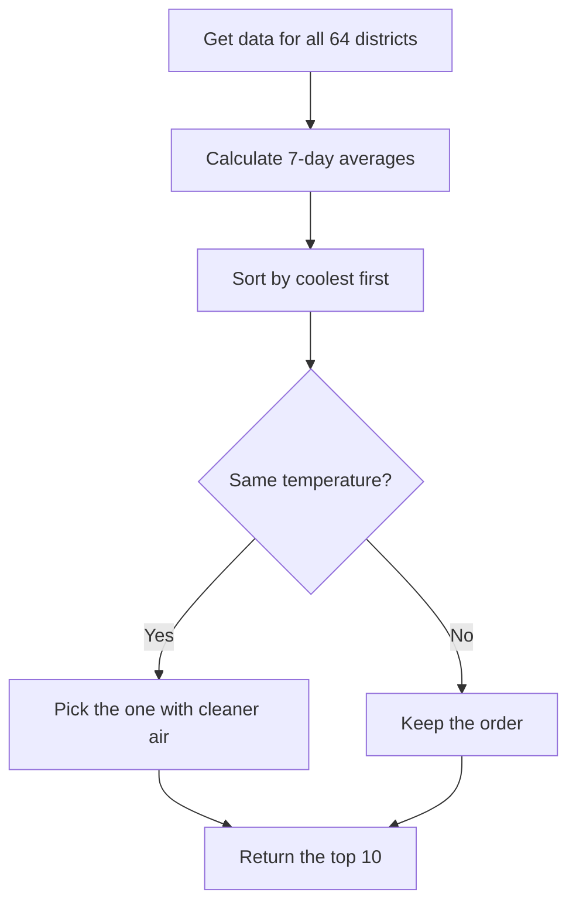
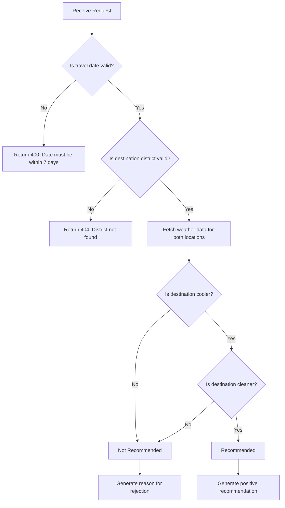
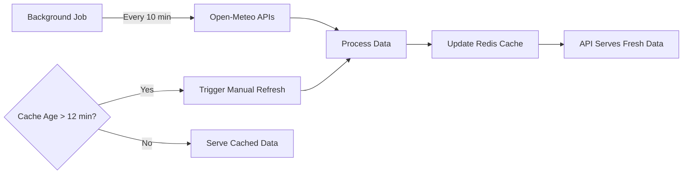
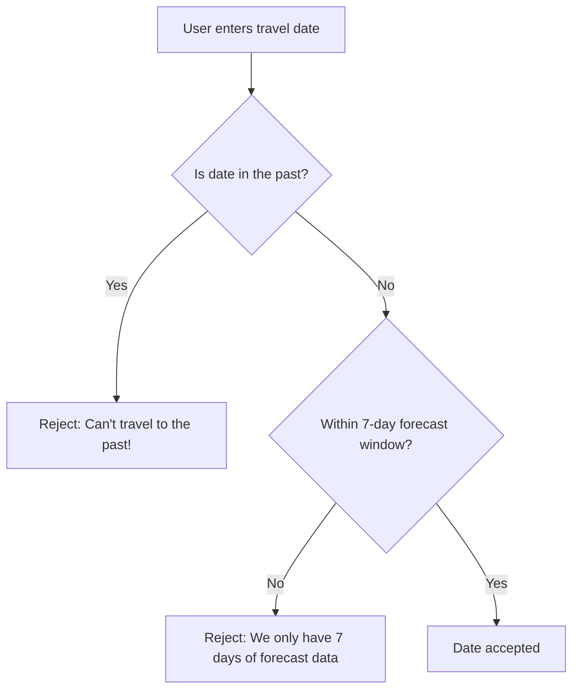
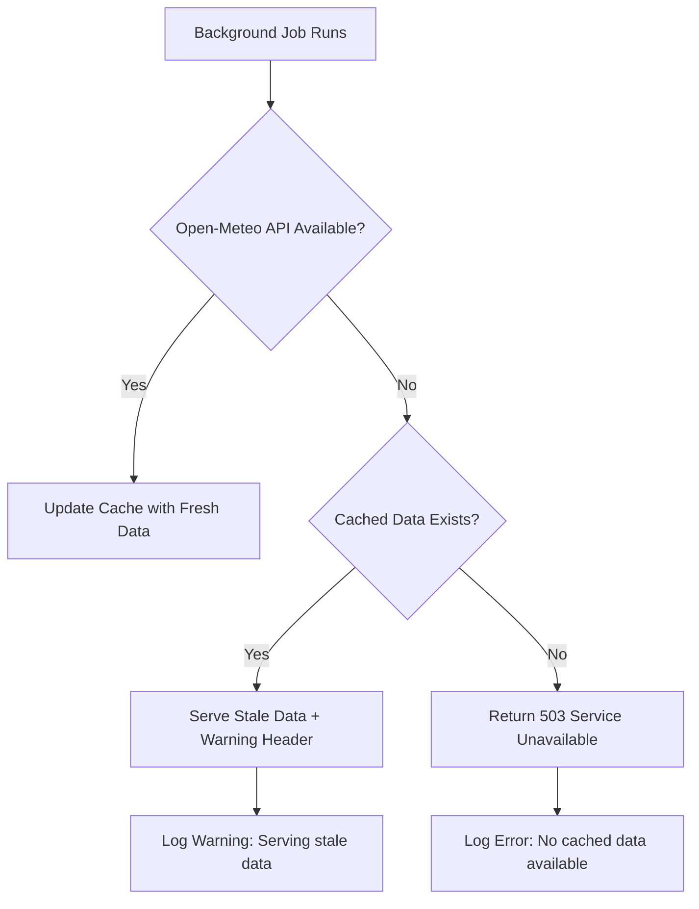
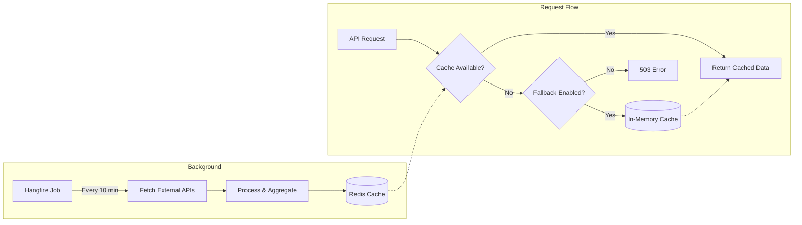

# SafeTravel Bangladesh API — Requirements Document

**Version:** 1.0  
**Last Updated:** February 5, 2026  
**Status:** Final

---

## 1. What is SafeTravel?

SafeTravel is a smart travel companion API that helps you find the **coolest** and **cleanest** places to visit in Bangladesh. It analyzes weather forecasts and air quality data across all 64 districts to answer two simple questions:

1. **"Where should I go?"** → Get the top 10 best destinations right now
2. **"Should I travel there?"** → Get a personalized recommendation for any district

---

## 2. Business Requirements

### 2.1 The Problem We're Solving

Planning a trip in Bangladesh? You probably check the weather forecast. But what about air quality? PM2.5 levels can vary dramatically between districts, and that matters for your health. Currently, there's no easy way to combine both factors into a simple "go" or "don't go" answer.

### 2.2 What We're Aiming For

| Goal | What It Means |
|------|---------------|
| **Fast Answers** | Get recommendations in under 500ms — no waiting around |
| **Health First** | We factor in air quality (PM2.5) because breathing matters |
| **Always Available** | Handle lots of users without slowing down |

---

## 3. Functional Requirements

### 3.1 "Where Should I Go?" — Top 10 Districts

**Endpoint:** `GET /api/v1/districts/top10`

This is your go-to endpoint when you just want to find the best places to visit. We rank all 64 districts and give you the top 10 coolest and cleanest options.

| What You Get | Details |
|--------------|----------------|
| **Response** | Top 10 districts, ranked by temperature and air quality |
| **Speed** | Under 500ms — we cache everything |
| **How Fresh?** | Data refreshes every 10 minutes in the background |

**How We Rank Districts:**



**How We Calculate the Numbers:**

We focus on **2 PM conditions** because that's typically the hottest part of the day — when you're most likely to be out and about.

| Metric | How It's Calculated |
|--------|--------------------|
| **Temperature** | Average 2 PM temp over the next 7 days |
| **PM2.5** | Average 2 PM air quality over the next 7 days |

**Response Schema:**

```json
{
  "rankedDistricts": [
    {
      "rank": 1,
      "districtName": "Sylhet",
      "averageTemperature": 24.5,
      "averagePM25": 12.3,
      "dataTimestamp": "2026-02-05T12:00:00Z"
    }
  ],
  "cacheAge": "00:05:32"
}
```

---

### 3.2 "Should I Travel There?" — Personalized Recommendation

**Endpoint:** `POST /api/v1/travel/recommendation`

Got a specific destination in mind? Tell us where you are and where you want to go, and we'll tell you if it's worth the trip.

| What You Need | Details |
|---------------|----------------|
| **Your Location** | Your current coordinates (latitude/longitude) |
| **Destination** | Which district you want to visit |
| **Travel Date** | When you plan to go (within 7 days) |

**Request Schema:**

```json
{
  "currentLocation": {
    "latitude": 23.8103,
    "longitude": 90.4125
  },
  "destinationDistrict": "Sylhet",
  "travelDate": "2026-02-07"
}
```

**Decision Logic:**



**When Do We Say "Go For It"?**

We only recommend travel when the destination is **both** cooler AND has better air quality. No compromises.

| Check | Must Be True |
|-------|--------------|
| Temperature | Destination is cooler than where you are |
| Air Quality | Destination has lower PM2.5 than where you are |
| **Bottom Line** | Both must pass, or we say "Not Recommended" |

**Response Schema:**

```json
{
  "recommendation": "Recommended",
  "reason": "Sylhet is 3.2°C cooler and has 40% better air quality than your location.",
  "comparison": {
    "current": { "temperature": 28.5, "pm25": 45.2 },
    "destination": { "temperature": 25.3, "pm25": 27.1 }
  },
  "travelDate": "2026-02-07"
}
```

---

### 3.3 FR-03: Health Check Endpoints

| Endpoint | Purpose | Response |
|----------|---------|----------|
| `GET /health/live` | Liveness probe | `200 OK` if service is running |
| `GET /health/ready` | Readiness probe | `200 OK` if Redis connected and data is available |

---

## 4. Non-Functional Requirements

### 4.1 NFR-01: Performance

| Metric | Target |
|--------|--------|
| Response Time (p99) | ≤ 500 ms |
| Throughput | ≥ 1000 requests/second |
| Cache Hit Rate | > 99% |

### 4.2 NFR-02: Availability

| Metric | Target |
|--------|--------|
| Uptime | 99.9% |
| Recovery Time Objective (RTO) | < 5 minutes |
| Recovery Point Objective (RPO) | < 10 minutes (cache refresh interval) |

### 4.3 NFR-03: Data Freshness



| Parameter | Value |
|-----------|-------|
| Refresh Interval | 10 minutes |
| Staleness Threshold | 12 minutes |
| Fallback Behavior | Manual data load if no job running |

---

## 5. Data Sources

### 5.1 District Coordinates

| Attribute | Value |
|-----------|-------|
| **Source** | [bd-districts.json](https://raw.githubusercontent.com/strativ-dev/technical-screening-test/main/bd-districts.json) |
| **Format** | JSON array with district name, latitude, longitude |
| **Count** | 64 districts |
| **Update Frequency** | Static (loaded at startup) |

### 5.2 Weather Forecast API

| Attribute | Value |
|-----------|-------|
| **Provider** | [Open-Meteo](https://open-meteo.com/) |
| **Endpoint** | Weather Forecast API |
| **Data Points** | Hourly temperature for 7 days |
| **Rate Limit** | 10,000 requests/day (free tier) |

### 5.3 Air Quality API

| Attribute | Value |
|-----------|-------|
| **Provider** | [Open-Meteo](https://open-meteo.com/) |
| **Endpoint** | Air Quality API |
| **Data Points** | Hourly PM2.5 for 7 days |
| **Rate Limit** | 10,000 requests/day (free tier) |

---

## 6. Validation Rules

### 6.1 Travel Date Validation



### 6.2 Destination District Validation

| Check | Action on Failure |
|-------|-------------------|
| District name exists | Return `404 Not Found` |
| Case sensitivity | Case-insensitive matching |
| Whitespace handling | Trim leading/trailing spaces |

### 6.3 Current Location Validation

| Field | Validation |
|-------|------------|
| Latitude | Must be between -90 and 90 |
| Longitude | Must be between -180 and 180 |
| Bangladesh bounds (optional) | Warning if outside Bangladesh region |

---

## 7. Error Handling

### 7.1 Error Response Schema

```json
{
  "type": "https://tools.ietf.org/html/rfc7807",
  "title": "Bad Request",
  "status": 400,
  "detail": "Travel date must be within the next 7 days.",
  "instance": "/api/v1/travel/recommendation",
  "traceId": "00-abc123-def456-00"
}
```

### 7.2 Error Scenarios

| Scenario | HTTP Status | Response |
|----------|-------------|----------|
| Invalid travel date | 400 | Date validation error |
| District not found | 404 | District lookup error |
| Cache unavailable, no fallback | 503 | Service unavailable |
| External API failure | 503 | Include stale data warning if available |

### 7.3 External API Failure Handling



---

## 8. API Design

### 8.1 Versioning Strategy

| Aspect | Decision |
|--------|----------|
| Method | URL-based versioning |
| Format | `/api/v1/...` |
| Rationale | Clear, explicit, and cache-friendly |

### 8.2 HTTP Methods

| Endpoint | Method | Justification |
|----------|--------|---------------|
| `/api/v1/districts/top10` | GET | Read-only, cacheable |
| `/api/v1/travel/recommendation` | POST | Complex request body with coordinates |

### 8.3 Authentication

| Aspect | Decision |
|--------|----------|
| Public Endpoints | No authentication required |
| Hangfire Dashboard | Basic authentication (admin only) |
| Rate Limiting | By IP address (optional) |

---

## 9. Caching Strategy

### 9.1 Architecture



### 9.2 Cache Configuration

| Parameter | Primary (Redis) | Fallback (In-Memory) |
|-----------|-----------------|---------------------|
| TTL | No expiry (overwritten) | 15 minutes |
| Key Pattern | `districts:top10`, `districts:{name}` | Same |
| Serialization | JSON | Native .NET |

---

## 10. Technology Stack

| Component | Technology | Justification |
|-----------|------------|---------------|
| Runtime | .NET 10, ASP.NET Core | Latest LTS, high performance |
| Architecture | Clean Architecture | Separation of concerns |
| CQRS | LiteBus | Lightweight, minimal overhead |
| Caching | Redis | Distributed, persistent, scalable |
| Fallback Cache | IMemoryCache | Zero infrastructure dependency |
| Background Jobs | Hangfire | Reliable, persistent, dashboard |
| HTTP Client | IHttpClientFactory | Connection pooling, resilience |
| Logging | Serilog + Grafana/Loki | Structured, centralized |
| Validation | FluentValidation | Declarative, testable |

---

## 11. Acceptance Criteria

### 11.1 Top 10 Districts

- [ ] Returns exactly 10 districts (or fewer if less than 10 available)
- [ ] Districts are sorted by temperature ascending
- [ ] Ties are broken by PM2.5 ascending
- [ ] Response includes average temperature and PM2.5 for each district
- [ ] Response time ≤ 500ms under normal load

### 11.2 Travel Recommendation

- [ ] Returns "Recommended" only when destination is both cooler AND cleaner
- [ ] Returns "Not Recommended" with reason for all other cases
- [ ] Validates travel date is within 7-day forecast window
- [ ] Validates destination district exists
- [ ] Response includes comparison data for both locations

### 11.3 System

- [ ] Background job runs every 10 minutes
- [ ] Stale data (>12 min) triggers manual refresh
- [ ] Health endpoints correctly report service status
- [ ] Structured logging captures request/response correlation

---

## 12. Glossary

| Term | Definition |
|------|------------|
| **PM2.5** | Particulate Matter ≤ 2.5 micrometers, a key air quality indicator |
| **Staleness Threshold** | Maximum acceptable age of cached data before triggering refresh |
| **CQRS** | Command Query Responsibility Segregation pattern |
| **p99** | 99th percentile response time |
| **RTO** | Recovery Time Objective - target time to restore service |
| **RPO** | Recovery Point Objective - acceptable data loss window |

---

## Appendix A: Decision Summary

| # | Decision Area | Final Decision |
|---|---------------|----------------|
| 1 | Caching Strategy | Hangfire + Redis (Primary), IHostedService + IMemoryCache (Fallback) |
| 2 | 7-Day Window | Today + next 6 days |
| 3 | Temperature Metric | Hourly value at 14:00, averaged over 7 days |
| 4 | PM2.5 Metric | Value at 14:00, averaged over 7 days |
| 5 | Ranking Order | Ascending Temperature, then Ascending PM2.5 |
| 6 | Recommendation Logic | Strict AND condition (both metrics must be better) |
| 7 | Destination Input | District name (string, case-insensitive) |
| 8 | Date Validation | Must be within next 7 days |
| 9 | API Versioning | URL-based (`/api/v1/...`) |
| 10 | Authentication | None (public API) |
| 11 | Logging | Serilog + Grafana/Loki |
| 12 | Refresh Interval | 10 minutes |
| 13 | Staleness Threshold | 12 minutes |
